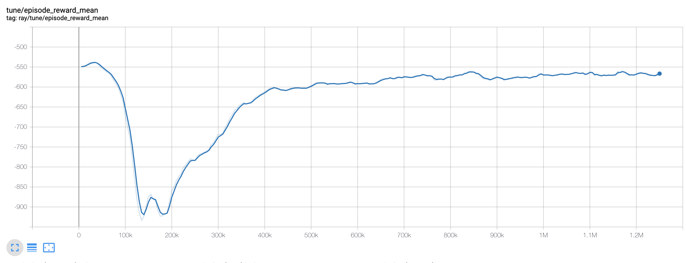
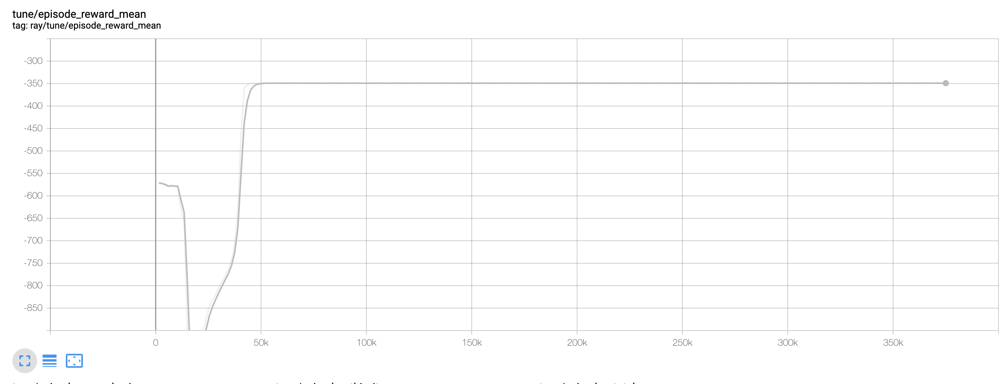
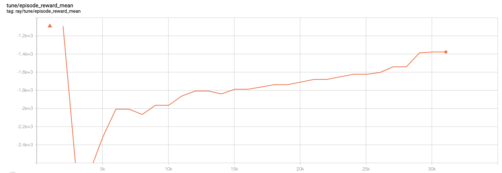
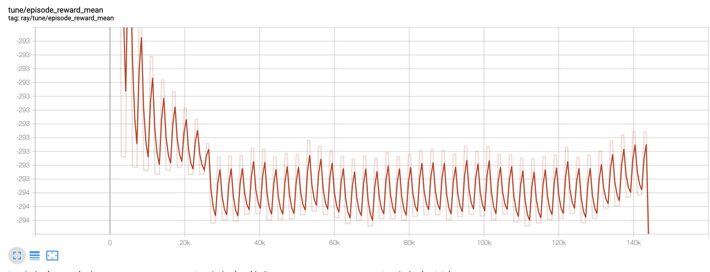

# Code repository - Traffic simulations using DDPG and MADDPG

This repository deals with the practical application of the MADDPG multi-agent reinforcement learning model as part of the seminar "Advanced Topics in Reinforcement Learning" by the Neural Information Processing Group @ TU Berlin.

### Intro
I attempt to apply different configurations of the DDPG (Lillicrap et al.) and MADDPG (Lowe et al.) models onto a traffic light grid environment.
The papers of these two papers can be found [here (MADDPG)](https://arxiv.org/abs/1706.02275) and [here (DDPG)](https://arxiv.org/abs/1509.02971).

All experiments rely heavily on the traffic simulation project flow ( [see flow-project.github.io](https://flow-project.github.io/) ) and the reinforcement learning library RLlib ( [ see https://ray.readthedocs.io/en/latest/rllib-env.html](https://ray.readthedocs.io/en/latest/rllib-env.html) ).

I folked the flow repository and started to define my experiments ( [see examples/rl/multiagent/](https://github.com/dissendahl/flow/tree/master/examples/exp_configs/rl/multiagent) ) using the preexisting MultiTrafficLightGridPOEnv environment. Here is a gif, showing that environment type:


In all experiments, the environment consists of a 9x9-grid with one lane in each direction and cars constantly entering from the borders of the simulation, traversing the grid left-right / up-down (or vice versa). The traffic grid, looks something like this:

 

At each of the nine crossing one traffic light agent switches the light phases, allowing either left-right or up-down traffic at each simulation step. The traffic lights are either toggled according to a fixed strategy (see baseline measurement) or by a reinforcement learning agent.

The agents receive local observations about the speed and distance of the nearest cars as well as information about their neighbouring traffic lights ( [see flow/envs/multiagent/traffic_light_grid](flow/envs/multiagent/traffic_light_grid.py#L90) ) (partially observable setting) and receive a reward signal about the average delay over all vehicles plus a penality for standing vehicles ( [see flow/core/rewards.py](flow/core/rewards.py#L179) ) in each timestep of the simulation.

The agents' action spaces simply consist of one continous action value in the range [0,1].
If it is below or equal 0.5, the environment will not change the light phase at a given intersection and if it is above 0.5, it will initiate a change of the traffic light phase.

As documented below, I have run a baseline measurement, two runs with a single agent switching all lights and am currently running multi agent experiments on the provide hardware (thanks to Vaios) by the neural information processing group.

### Installation & setup

##### Install Miniconda if not installed
https://docs.conda.io/en/latest/miniconda.html

##### Create environment & setup flow
```shell
conda create --name maddpg python=3.6 -y
conda activate maddpg
python3.6 setup.py develop
```

##### Install sumo (traffic simulator) binaries
```shell
scripts/setup_sumo_osx.sh
#scripts/setup_sumo_ubuntu1804.sh

export SUMO_HOME="$HOME/sumo_binaries/bin"
export PATH="$SUMO_HOME:$PATH"     
# verify that sumo is installed
sumo --version
```

##### Install Ray commit with refactored exploration noise API if needed
```shell
pip uninstall ray -y
pip install https://ray-wheels.s3-us-west-2.amazonaws.com/master/2d97650b1e01c299eda8d973c3b7792b3ac85307/ray-0.9.0.dev0-cp36-cp36m-macosx_10_13_intel.whl
```

### Experiments documentation
1. Non-RL actuated lights baseline - Can be run by:
```shell
python simulate.py traffic_light_grid_edit
```
See [rendered simulation](examples/results/renderings/baseline.mov) and [simulation metrics](examples/results/simulation_metrics/baseline.txt).

2. PPO - No artefacts stored.


3. TD3 (Improvement of DDPG) - Converged to policy where all traffic lights toggle synchronously.
See [rendered simulation](examples/results/renderings/td3.mov) and [simulation metrics](examples/results/simulation_metrics/td3_225.txt).


4. DDPG - One actor per traffic light / Mutual critic. Training terminated due to leaking experience buffer. See [rendered simulation](examples/results/renderings/ddpg_multi_policy.mov) and [simulation metrics](examples/results/simulation_metrics/ddpg_multi_agent_25.txt). When observing the simulation, we can see that this setup - employing local actor / mutual critic - leads to individual actions which we could argue demonstrates, that the setup picks up local optimisation signals while learning.


5. MADDPG - No learning. Possible due to missing noise.


Apparently there is a bug in the implementation. I talked to the code maintainer and together, we figured out that 1st exploration noise is missing and 2nd there is some weirdness within the action space output. Since the exploration noise implementation from DDPG was currently refactored into a genral purpose noise API within ray, I decided to wait and try the earliest dev release enabling MADDPG to use that API.

6. MADDPG - Updated flair to version 0.9.0dev with noise implementation. Still no learning. Roll back to latest stable ray version.

Observation: MADDPG action outputs are all 1. Next: Investigate what is going wrong here.

7. Improved maddpg_policy.py
* The actor network outputed OneHotCategorical Distribution over batch because the MPE environment takes OneHotCategorical input, which I manually removed.
* Added exploration noise as seen in ddpg_policy.py in new dev verssion (0.9.0).
* [See](maddpg_policy.py)

### Planned Experiments - (Currently executed on worker4):
1. Rerun DDPG experiments with multiple policies
```shell
python3.6 train_ddpg_local_critic.py multiagent_ddpg_multi
```
2. Run MADDPG with hyperparameter search and custom maddpg_policy.py


### Training results

All training results, model artefacts, learning curves, etc. for performed experiments are located within [examples/results](examples/results).

------------------------------------------------------------------------------------------------------------------------------


# Legacy Documentation before Folk
## Flow

[Flow](https://flow-project.github.io/) is a computational framework for deep RL and control experiments for traffic microsimulation.

See [our website](https://flow-project.github.io/) for more information on the application of Flow to several mixed-autonomy traffic scenarios. Other [results and videos](https://sites.google.com/view/ieee-tro-flow/home) are available as well.

# More information
- [Documentation](https://flow.readthedocs.org/en/latest/)
- [Installation instructions](http://flow.readthedocs.io/en/latest/flow_setup.html)
- [Tutorials](https://github.com/flow-project/flow/tree/master/tutorials)
- [Binder Build (beta)](https://mybinder.org/v2/gh/flow-project/flow/binder)

# Technical questions

If you have a bug, please report it. Otherwise, join the [Flow Users group](https://forms.gle/CuVBu6QtX3dfNaxz6) on Slack! You'll recieve an email shortly after filling out the form.

# Getting involved

We welcome your contributions.

- Please report bugs and improvements by submitting [GitHub issue](https://github.com/flow-project/flow/issues).
- Submit your contributions using [pull requests](https://github.com/flow-project/flow/pulls). Please use [this template](https://github.com/flow-project/flow/blob/master/.github/PULL_REQUEST_TEMPLATE.md) for your pull requests.

# Citing Flow

If you use Flow for academic research, you are highly encouraged to cite our paper:

C. Wu, A. Kreidieh, K. Parvate, E. Vinitsky, A. Bayen, "Flow: Architecture and Benchmarking for Reinforcement Learning in Traffic Control," CoRR, vol. abs/1710.05465, 2017. [Online]. Available: https://arxiv.org/abs/1710.05465

If you use the benchmarks, you are highly encouraged to cite our paper:

Vinitsky, E., Kreidieh, A., Le Flem, L., Kheterpal, N., Jang, K., Wu, F., ... & Bayen, A. M,  Benchmarks for reinforcement learning in mixed-autonomy traffic. In Conference on Robot Learning (pp. 399-409). Available: http://proceedings.mlr.press/v87/vinitsky18a.html

# Contributors

Flow is supported by the [Mobile Sensing Lab](http://bayen.eecs.berkeley.edu/) at UC Berkeley and Amazon AWS Machine Learning research grants. The contributors are listed in [Flow Team Page](https://flow-project.github.io/team.html).
